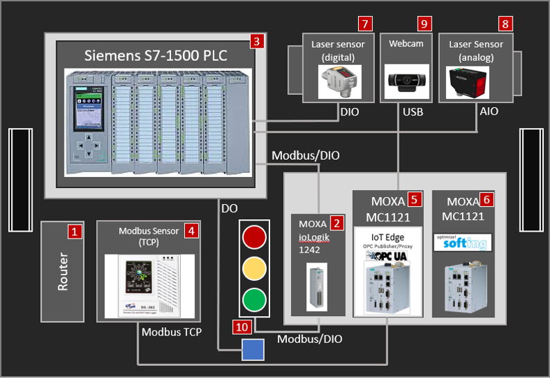
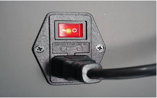
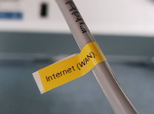
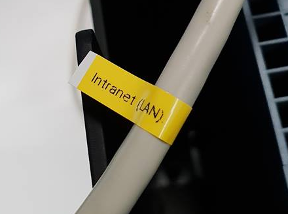
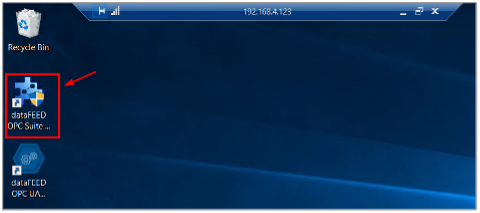
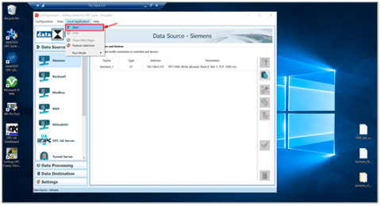
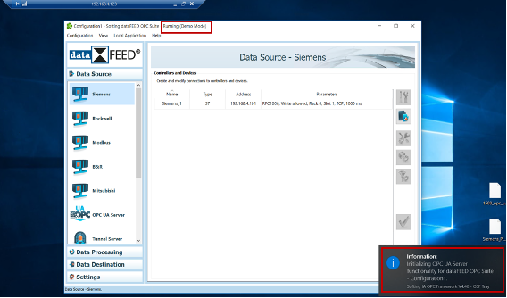

# Manufacturing in a Box<br>Starter Guide
Instructions for you to connect and deploy the pre-built sensors with PLC to IoT Central in 1 hour.
<br><br>
*Version 2.00*<br>
Last Updated 2022-06-27

## Table of Contents
  - [Quick Demo](#quick-demo)
    - [Quick overview before you start](#quick-overview-before-you-start)  
    - [Step-by-step configuration](#step-by-step-configuration)  
      1. [Power on MiaB](#power-on-miab)  
      1. [Connect the internet](#connect-the-internet)  
      1. [Connect using your own PC](#connect-using-your-own-pc)  
      1. [Basic environment checking](#basic-environment-checking)  
      1. [IIoT Gateway - Softing dataFeed OPC Suite](#iiot-gateway---softing-datafeed-opc-suite)  
      1. [XXXX install ARC agent run e2e tool](#sxsxxxx)  
      1. [XXXX run e2e tool](#sxsxxxx)  
      1. [XXXX test opcwrite](#sxsxxxx)  
      1. [XXXX view data in ADX](#sxsxxxx)  
  - Simplified POC  
    - Extend MiaB to fit your product line  
      - Use your own PLC  

## Quick Demo
## Quick overview before you start
The Manufacturing in a Box (MiaB) includes pre-configured hardware components. You can configure and connect MiaB to Azure with minimal steps.  
<br>
| | Hardware | Use | IP Address |
| :-: | :- |:- | :- |
| 1 | TP-Link TL-R470T+ | Router | 192.168.4.1 |
| 2 | MOXA ioLogik 1242  | Remote I/O | 192.168.4.100 |
| 3 | Siemens S7-1500  | PLC | 192.168.4.101 |
| 4 | ICP-DAS DL-302  | Modbus Sensor (Modbus TCP) | 192.168.4.103 |
| 5 | MOXA MC1121  | IIoT Gateway - IoT Edge | 192.168.4.121 |
| 6 | MOXA MC1121  | IIoT Gateway - Softing dataFEED OPC Suite | 192.168.4.123 |
| 7 | Banner - LE550 Laser Sensor  | Analog Laser Sensor | |
| 8 | Banner - Q4X Laser Sensor  | Digital Laser Sensor | |
| 9 | Logitech - C922 Pro Webcam  | Webam | |
| 10 | Light (Red/Yellow/Green/Blue)  | Indicator Lights | |

## Step-by-step configuration
### Power on MiaB
<br>
Connect the power plug to the wall outlet. Turn on the power switch on the top-right corner of MiaB Box.

### Connect the internet
<br>
The Manufacturing-in-a-Box has its own pre-built local LAN and we reserve a RJ45 Cable for you to plug it to your network with internet access.  

Please find the RJ45 cable with the yellow label marked as *__Internet (WAN)__* and plug it to your network with internet access.

### Connect using your own PC
We reserve another RJ45 cable for you to connect your PC to MiaB. With minimum configuration steps, you can see the demo box go live and collect and upload sensor data to Azure.  

<br>
Find the RJ45 cable with the yellow label marked as __*Intranet (LAN)*__ and plug it to your PC. With DHCP assignment, this will connect your PC to the local LAN of MiaB.

### Basic environment checking
Using the `ping` tool from a command line, confirm the hardware components are online:
```
ping 192.168.4.100
ping 192.168.4.101
ping 192.168.4.103
ping 192.168.4.121
ping 192.168.4.123
```
If the hardware components are online you will see a reply that looks like this (depending on your environment the host and command line may look different):
```
miabusr@ubuntu:~$ ping 192.168.4.100
PING 192.168.4.100 (192.168.4.100) 56(84) bytes of data.
64 bytes from 192.168.4.100: icmp_seq=1 ttl=255 time=5.79 ms
64 bytes from 192.168.4.100: icmp_seq=2 ttl=255 time=2.05 ms
64 bytes from 192.168.4.100: icmp_seq=3 ttl=255 time=2.01 ms
^C
--- 192.168.4.100 ping statistics ---
3 packets transmitted, 3 received, 0% packet loss, time 2003ms
rtt min/avg/max/mdev = 2.017/3.290/5.795/1.771 ms

miabusr@ubuntu:~$ 
```
> NOTE: The IP Address for each hardware component:  

| IP Address | Hardware Component |
| :- |:- |
| 192.168.4.100 |Remote I/O – MOXA ioLogik 1242 |
| 192.168.4.101 |PLC – Siemens S7-1500 |
| 192.168.4.103 |ICP-DAS DL-302 – Modbus Sensor |
| 192.168.4.121 |MOXA MC1121 – IoT Edge |
| 192.168.4.123 |MOXA MC1121 – Softing OPC Suite |

Using `ssh`, connect to the MOXA MC1121 device at IP Address 192.168.4.121, which is running Linux and hosting the IoT Edge runtime:
```
ssh miabusr@192.168.4.121
```

> NOTE: The username is `miabusr` and the password is `miab168!`
> NOTE: If you are using Windows you can use the PuTTY client to connect to the IoT Edge host using ssh. Or, you can use the WSL2 (Linux Subsystem for Windows using the above command).

When you are connected to the IoT Edge host, very that the internet connection is active:
```
miabusr@ubuntu:~$ ping www.microsoft.com
PING e13678.dscb.akamaiedge.net (104.97.41.163) 56(84) bytes of data.
64 bytes from a104-97-41-163.deploy.static.akamaitechnologies.com (104.97.41.163): icmp_seq=1 ttl=52 time=10.9 ms
64 bytes from a104-97-41-163.deploy.static.akamaitechnologies.com (104.97.41.163): icmp_seq=2 ttl=52 time=12.0 ms
64 bytes from a104-97-41-163.deploy.static.akamaitechnologies.com (104.97.41.163): icmp_seq=3 ttl=52 time=11.8 ms
64 bytes from a104-97-41-163.deploy.static.akamaitechnologies.com (104.97.41.163): icmp_seq=4 ttl=52 time=17.3 ms
64 bytes from a104-97-41-163.deploy.static.akamaitechnologies.com (104.97.41.163): icmp_seq=5 ttl=52 time=15.4 ms
^C
--- e13678.dscb.akamaiedge.net ping statistics ---
5 packets transmitted, 5 received, 0% packet loss, time 4006ms
rtt min/avg/max/mdev = 10.922/13.513/17.349/2.461 ms

miabusr@ubuntu:~$ 
```
> NOTE: Your results may look different depending on your network configuration and location.

Next, using a Remote Desktop Connection application, connect to the MOXA MC1121 device at IP Address 192.168.4.123, which is running Windows software:

> NOTE: The Windows client username is `miabusr` and the password is `miab168!`
Once you are connected verify the internet connection is activing using the same procedure as above from a Windows Command terminal or using a WSL2 commandline.

Next, from the Windows desktop start the Softing OPC Suite software.  
  1. Double click the icon “dataFEED OPC Suite configuration” on the desktop:  
  <br>
  1. Click Local Application -> Start to bring up the service:  
  <br>
  1. Make sure the service is running:  
  <br>